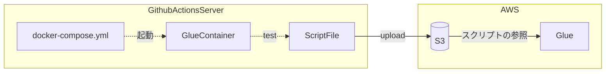

# テスト付きの glue scripts

## 全体像

GithubActions を使った CI/CD のイメージ



## テスト方法

```bash

cd glue-jobs-with-tests
docker compose up -d
./run_tests.sh tests/test_some_batch_script.py
```

- Spark・Glue の実行環境は docker で準備している
- docker 内に pytest がすでにインポートされているため、run_tests.sh でそれをキックする
